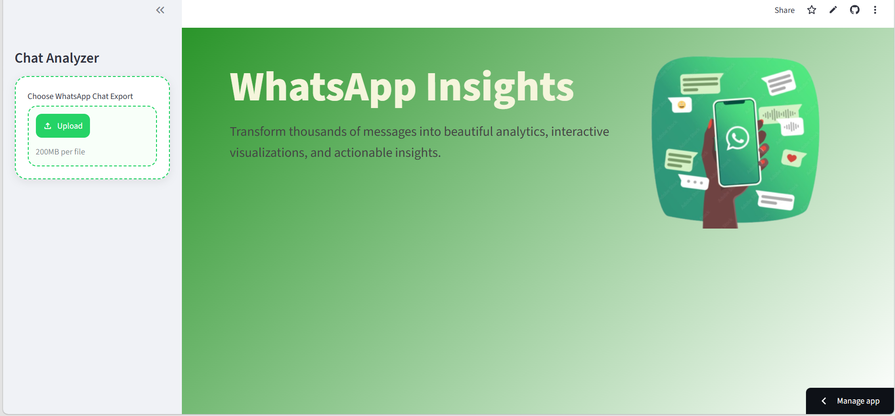
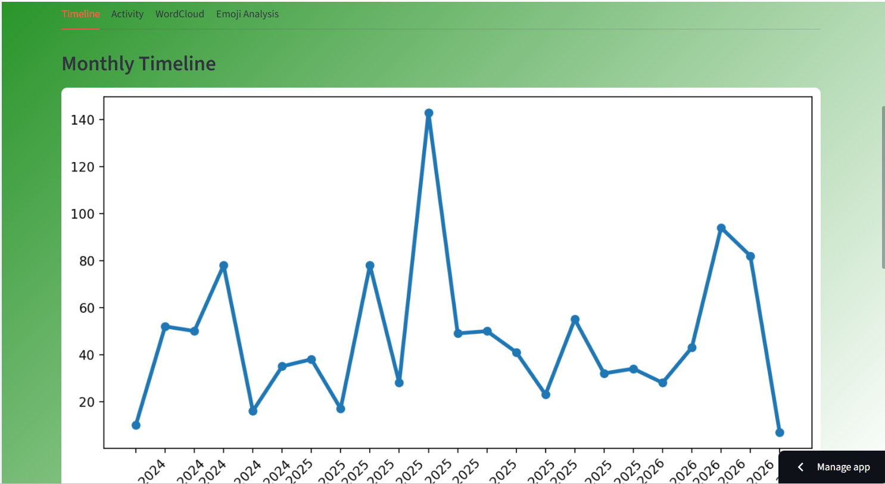

# WhatsApp Chat Analyzer

A web application built using Python and Streamlit that analyzes exported WhatsApp chat data and generates meaningful insights through statistics and visualizations.

## Overview

WhatsApp conversations contain valuable information about communication patterns, user activity, and engagement. This project allows users to upload exported WhatsApp chat files and explore various analytics related to messaging behavior.

The application processes raw chat data, performs text analysis, and presents the results through interactive visualizations and summary statistics.

---

## Application Preview

### Home Screen



### Chat Statistics


### Analysis Dashboard



--- 

## Features

### Chat Statistics

- Total number of messages
- Total words exchanged
- Media files shared
- Links shared

### User Analysis

- Most active users
- User contribution percentage
- Message distribution among participants

### Timeline Analysis

- Monthly activity timeline
- Daily activity timeline
- Activity trends over time

### Activity Patterns

- Most active days
- Most active months
- Weekly activity heatmap
- Hourly activity heatmap

### Text Analysis

- Word cloud generation
- Most frequently used words
- Stop-word filtering

### Emoji Analysis

- Most frequently used emojis
- Emoji usage statistics
- Emoji distribution

---

## Tech Stack

### Frontend

- Streamlit

### Backend

- Python

### Libraries Used

- Pandas
- NumPy
- Matplotlib
- Seaborn
- WordCloud
- URLExtract
- Emoji
- Regex

---

## Project Structure

```text
whatsapp-chat-analyzer/
│
├── app.py
├── helper.py
├── preprocessor.py
├── stop_hinglish.txt
├── requirements.txt
├── images/
│   └── banner.png
└── README.md
```

## Installation

### Clone the Repository

```bash
git clone https://github.com/your-username/whatsapp-chat-analyzer.git
cd whatsapp-chat-analyzer
```

### Install Dependencies

```bash
pip install -r requirements.txt
```

### Run the Application

```bash
streamlit run app.py
```

---

## How to Use

### Export a WhatsApp Chat

1. Open a WhatsApp chat.
2. Click on the three-dot menu.
3. Select "More".
4. Choose "Export Chat".
5. Select "Without Media".
6. Save the exported `.txt` file.

### Analyze the Chat

1. Launch the application.
2. Upload the exported chat file.
3. Explore the generated statistics and visualizations.

---

## Sample Insights

The application can help answer questions such as:

- Who is the most active participant?
- Which day receives the highest number of messages?
- What are the most commonly used words?
- Which emojis are used most frequently?
- At what time is the conversation most active?

---

## Learning Outcomes

This project helped in understanding:

- Data preprocessing
- Exploratory Data Analysis (EDA)
- Text processing and NLP basics
- Data visualization techniques
- Building interactive web applications using Streamlit
- End-to-end project deployment

---

## Future Improvements

Possible enhancements include:

- Sentiment analysis
- AI-powered chat summarization
- Conversation topic extraction
- Interactive dashboard filters
- Multi-language support
- Advanced user behavior analytics

---

## Deployment

The application can be deployed using:

- Streamlit Community Cloud
- Render
- Railway
- Hugging Face Spaces

---

## Disclaimer

This project is intended for educational and analytical purposes only. Users should ensure that chat data is analyzed responsibly and with appropriate consent.

---

## Author

Payal Sulaniya

This project was developed as part of my exploration of data analysis, NLP concepts, and Streamlit application development.
